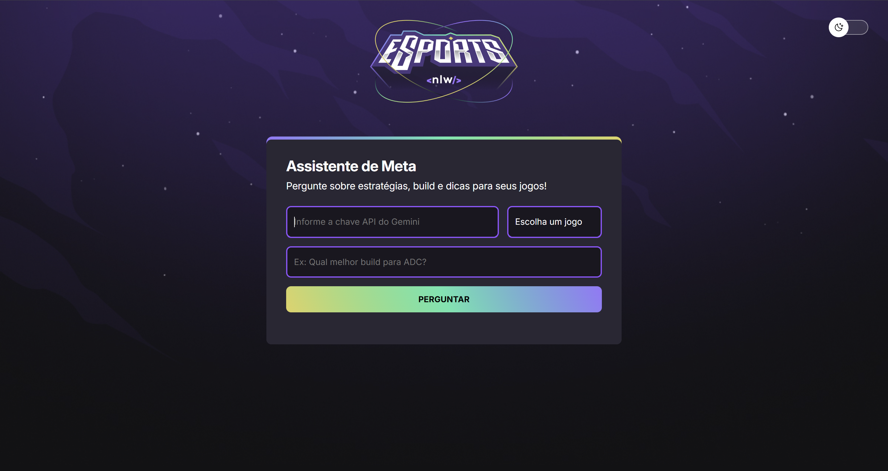

# NLW 20 • Agents

Projeto desenvolvido durante o **NLW 20 - Agents**, evento da Rocketseat focado na construção de aplicações modernas utilizando agentes inteligentes e ferramentas atuais do ecossistema JavaScript.

---

## 🖥 Preview

---

## 📌 Sobre o projeto

Este projeto foi desenvolvido durante a **Next Level Week 20**, evento promovido pela Rocketseat.

A proposta é construir uma aplicação utilizando conceitos modernos de desenvolvimento, explorando:

- Estruturação de projetos
- Integração com APIs
- Organização de código
- Boas práticas de desenvolvimento

O projeto serve como base de aprendizado e prática para construção de aplicações com agentes.

---

## 🚀 Tecnologias utilizadas

Este projeto foi desenvolvido com as seguintes tecnologias:

- JavaScript
- Node.js
- HTML
- CSS
- APIs externas
- Git
- GitHub

---

## 🎯 Aprendizados

Durante o desenvolvimento deste projeto foram praticados conceitos como:

- Estruturação de projetos modernos
- Organização de código
- Consumo de APIs
- Boas práticas de desenvolvimento
- Versionamento de código com Git

---

## 📚 Créditos

Projeto desenvolvido durante o **NLW 20 - Agents** da Rocketseat.

---

## 👨‍💻 Autor

**Bruno Antoneli**

GitHub  
https://github.com/bantoneli
